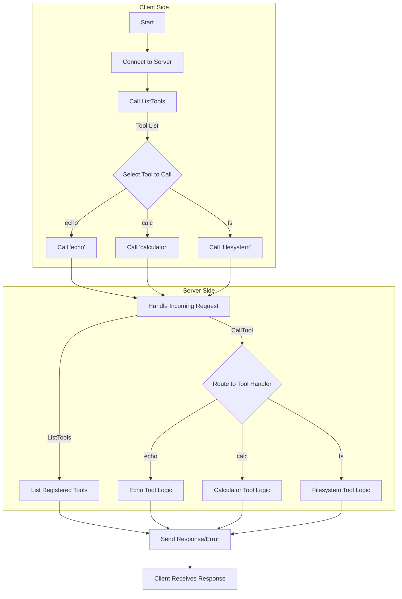

# Basic Example

> **Multi-Tool MCP Server & Client.** A foundational example demonstrating an MCP server offering multiple, distinct tools (`echo`, `calculator`, `filesystem`), alongside a client that discovers and interacts with them.

---

## Why This Multi-Tool Example?

| Goal                     | How Basic Example Helps                                |
| ------------------------ | ------------------------------------------------------ |
| **Multiple Tool Mgmt**   | Shows registration and handling of diverse tools       |
| **Client Interaction**   | Demonstrates tool discovery (`ListTools`) & invocation |
| **Argument Handling**    | Illustrates typed arguments and validation             |
| **Error Management**     | Provides patterns for robust tool error reporting      |
| **Practical Foundation** | Offers a solid base for building more complex servers  |

The example showcases:

1. **Server:** Registering and implementing tools with varied logic (simple echo, arithmetic, I/O).
2. **Client:** Connecting, discovering tools, calling each tool with parameters, and handling responses/errors.

---

## Tool Line-Up

| Tool         | Responsibility                                                      |
| ------------ | ------------------------------------------------------------------- |
| `echo`       | Simple text echo service; returns the input message.                |
| `calculator` | Basic arithmetic (add, subtract, multiply, divide) with validation. |
| `filesystem` | Sandboxed file operations (list, read, write) in `./fs_sandbox`.    |

**Key Client Features**

- Dynamic tool discovery via `ListTools`.
- Invocation of multiple tools with distinct arguments.
- Handling of both successful text responses and potential tool errors.

---

## Architecture



---

## Quick Start

> **Prerequisite:** Go 1.24+

1.  **Start the Server:**

    ```bash
    cd server
    go run .
    # This creates the ./fs_sandbox directory if it doesn't exist
    ```

2.  **Run the Client:**
    ```bash
    cd client
    go run .
    ```

The client automatically connects, lists tools, tests each one, and prints the output.

---

## Features Deep Dive

### Server-Side (`server/`)

- **Modular Tools:** Tool logic separated into `calculator.go` and `filesystem.go`.
- **Typed Arguments:** Uses structs (`EchoArgs`, `CalculatorArgs`, `FileSystemArgs`) for automatic argument parsing and validation.
- **Helper Registration:** Uses `server.AddTool` for simplified tool definition.
- **Filesystem Sandboxing:** `filesystem` tool is restricted to the `./fs_sandbox` directory for safety.
- **Error Handling:** Returns specific errors for invalid operations or missing arguments.

### Client-Side (`client/main.go`)

- **Connection:** Establishes connection using `client.NewSSEClient` and `Connect`.
- **Tool Discovery:** Fetches available tools using `clt.ListTools`.
- **Dynamic Invocation:** Iterates through discovered tools and calls them using `clt.CallTool`.
- **Response Handling:** Parses responses, checks the `IsError` flag, and extracts content.
- **Comprehensive Testing:** Includes `main_test.go` for client-side testing.

---

## Extending the Example

- **Add Authentication:** Secure the `filesystem` or `calculator` tools using patterns from the `auth` example.
- **Introduce Resources/Prompts:** Add static data (`Resource`) or canned responses (`Prompt`).
- **Configuration:** Load server settings (e.g., sandbox path, allowed operations) from a file.
- **Streaming Responses:** Modify a tool to return multiple content chunks (e.g., file read progress).
- **More Complex Tools:** Implement tools that interact with databases, external APIs, or perform more complex logic.

---

## Project Structure

```
basic/
├── client/
│   ├── main.go         # MCP client: discovers and calls multiple tools
│   └── main_test.go    # Client tests
├── server/
│   ├── main.go         # Server setup and echo tool implementation
│   ├── calculator.go   # Calculator tool logic and args
│   ├── filesystem.go   # Filesystem tool logic and args
│   ├── main_test.go    # Server tests
│   └── Dockerfile      # Example container definition
├── go.mod              # Module dependencies
└── README.md           # You are here
```
