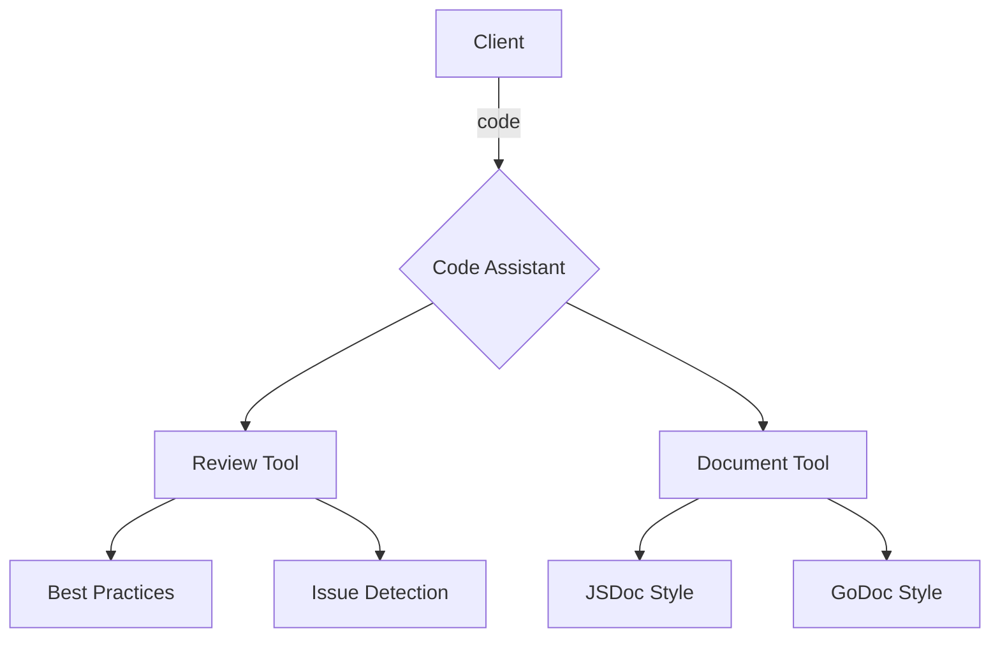

# Code Assistant Demo

> **AI-powered code analysis tools.** This example demonstrates how to build an MCP server that provides code review and documentation generation capabilities, showcasing both tool and prompt implementations.

---

## Why Code Assistant?

| Common Development Needs | How Code Assistant Helps                  |
| ------------------------ | ----------------------------------------- |
| Code Quality             | Automated best practice reviews           |
| Documentation            | Generate consistent docs across languages |
| Quick Feedback           | Instant analysis of potential issues      |
| Knowledge Sharing        | Example-driven documentation templates    |

The server provides two main capabilities:

1. **Code Review** - Analyze code for best practices and issues
2. **Documentation** - Generate standardized documentation in various styles

---

## Tool Line-Up

| Tool       | Responsibility                             |
| ---------- | ------------------------------------------ |
| `review`   | Analyze code for best practices and issues |
| `document` | Generate documentation in various styles   |

**Prompts & Resources**

- `review-prompt` - Interactive code review guidance
- `doc-examples` - Documentation style templates and examples

---

## Architecture



---

## Quick Start

> **Prerequisite:** Go 1.24+

```bash
# Run in stdio mode
$ go run .
```

Example review request:

```jsonc
{
  "method": "review",
  "params": {
    "code": "function test() { var x = 1; console.log(x); }",
    "language": "javascript"
  }
}
```

Example documentation request:

```jsonc
{
  "method": "document",
  "params": {
    "code": "function add(a, b) { return a + b; }",
    "language": "javascript",
    "style": "jsdoc"
  }
}
```

---

## Features

### Code Review

- Best practices analysis
- Language-specific checks
- Common issue detection
- Performance considerations
- Security recommendations

### Documentation Generation

- Multiple documentation styles:
  - JSDoc for JavaScript
  - GoDoc for Go
  - Custom styles
- Consistent formatting
- Example-driven templates

---

## Extending the Demo

- **Add Languages:** Extend support for Python, Ruby, or other languages
- **Custom Rules:** Add project-specific linting rules
- **Integration:** Connect with existing linting tools
- **AI Enhancement:** Add ML-based code analysis capabilities
- **Team Standards:** Incorporate company-specific coding standards

---

## Project Structure

```
code-assistant/
├── main.go     # server implementation with tools and handlers
└── README.md   # you are here
```
