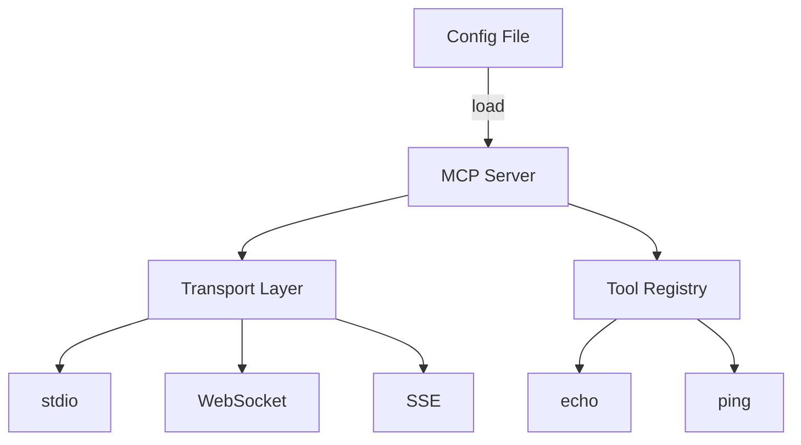

# JSON Configuration Demo

> **Configuration-driven MCP server.** This example demonstrates how to build a flexible MCP server that loads its configuration from JSON files, supporting multiple transport types and dynamic tool registration.

---

## Why JSON Configuration?

| Common Need               | How JSON Config Helps                  |
| ------------------------- | -------------------------------------- |
| Flexible Deployment       | Change behavior without recompiling    |
| Multiple Environments     | Use different configs per environment  |
| Dynamic Tool Registration | Add/modify tools through configuration |
| Transport Flexibility     | Switch transports via config file      |

The server supports three transport types:

1. **stdio** - For command-line and testing
2. **WebSocket** - For real-time web applications
3. **SSE** - For server-sent events

---

## Configuration Structure

```json
{
  "server_name": "ConfiguredMCPServer-JSON",
  "logger_level": "info",
  "transport": {
    "type": "websocket",
    "address": "127.0.0.1:8095",
    "path": "/mcp-ws"
  },
  "tools": [
    {
      "name": "echo",
      "description": "Simple echo tool (from config)"
    }
  ]
}
```

---

## Tool Line-Up

| Tool   | Responsibility                      |
| ------ | ----------------------------------- |
| `echo` | Returns the input message as-is     |
| `ping` | Simple health check, returns "pong" |

---

## Architecture



---

## Quick Start

> **Prerequisite:** Go 1.24+

```bash
# Run with stdio transport
$ go run server/main.go
```

Example request:

```jsonc
{
  "method": "echo",
  "params": {
    "message": "Hello from JSON config!"
  }
}
```

---

## Features

### Configuration Options

- Server name and logging level
- Transport selection and setup
- Dynamic tool registration
- Endpoint configuration

### Transport Types

- stdio for CLI/testing
- WebSocket for real-time
- SSE for server events

### Logging Levels

- debug
- info
- warn
- error

---

## Extending the Demo

- **Add Auth Config:** Configure authentication settings
- **Custom Tools:** Register new tools via config
- **More Transports:** Add gRPC or HTTP/REST
- **Validation:** Add config schema validation
- **Hot Reload:** Support config reloading

---

## Project Structure

```
json/
├── config.json     # server configuration
├── server/
│   └── main.go    # server implementation
└── README.md      # you are here
```
