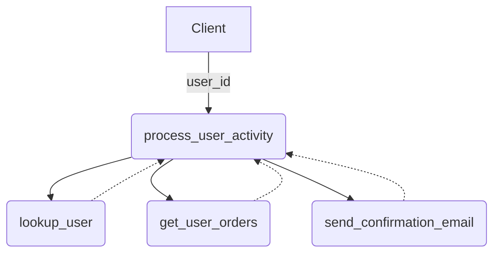

# Meta‑Tool Demo

> **Composable tools, single orchestration layer.** This example shows how to build small, focused MCP tools in Go and wire them together into a higher‑level "meta‑tool" that executes an end‑to‑end workflow.

---

## Why Composable Tools?

| Pain of a Monolith   | Benefit of Composable Tools                   |
| -------------------- | --------------------------------------------- |
| Hard to isolate bugs | Unit‑test each tool independently             |
| Risky deployments    | Touch one tool, deploy with confidence        |
| Limited reuse        | Mix‑and‑match tools in new workflows          |
| Tight coupling       | Swap implementations without breaking callers |

A typical user‑engagement flow needs to:

1. **Look up** the user profile
2. **Fetch** their recent orders
3. **Notify** them with a summary

Rather than coding that in one giant handler, we expose three atomic tools and stitch them together with a **meta‑tool**.

---

## Tool Line‑Up

| Tool                      | Responsibility                               |
| ------------------------- | -------------------------------------------- |
| `lookup_user`             | Return basic user profile fields             |
| `get_user_orders`         | List recent orders & status                  |
| `send_confirmation_email` | Fire off an email                            |
| `process_user_activity`   | **Meta‑tool** — orchestrates the three above |

---

## Architecture



_All sub‑tool calls are **in‑process** — no network hops, minimum latency._

---

## Quick Start

> **Prerequisite:** Go 1.24+

```bash
# Clone and run in stdio mode
$ git clone https://github.com/localrivet/gomcp.git
$ cd gomcp/examples/meta-tool-demo
$ go run .
```

Issue a request over stdin:

```jsonc
{ "method": "process_user_activity", "params": { "user_id": "alice" } }
```

The server will:

1. Look up `alice`
2. Pull her orders
3. Queue a confirmation email
4. Return a single consolidated response

---

## Extending the Demo

- **Swap channels :** Replace `send_confirmation_email` with `send_slack_dm` without touching the meta‑tool.
- **Add logic :** Insert `calculate_loyalty_points` to the chain and reflect that in the email template.
- **Production‑ise :** Wrap each handler with tracing, metrics, and a circuit‑breaker — the orchestration pattern stays identical.

---

## Project Structure

```
meta-tool-demo/
├── main.go     # server + handlers
└── README.md   # you are here
```
